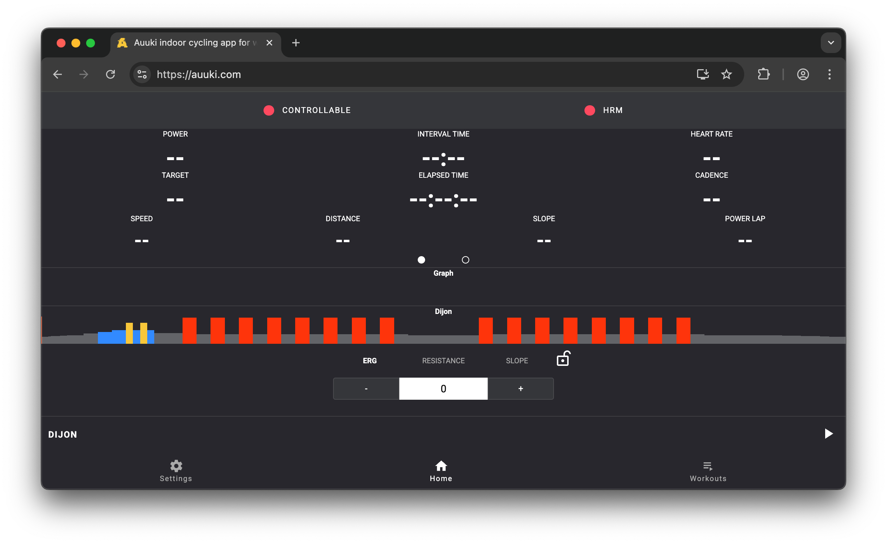
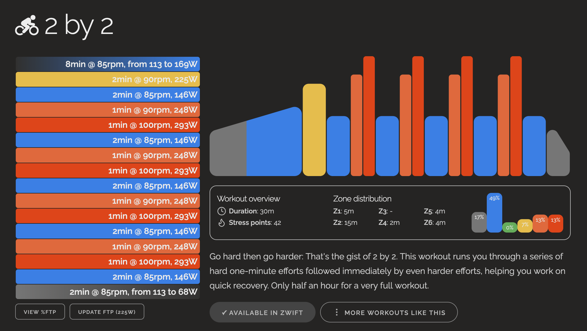
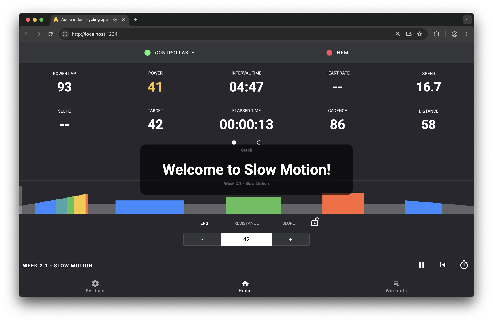

I like cycling. I don't like paying money regularly for an application that varies the resistance on my indoor bike.

I use a [Kickr Core](https://eu.wahoofitness.com/devices/indoor-cycling/bike-trainers/kickr-core-2-buy), which luckily isn't really "proprietary" in any sense of the word (despite, in my home setup, being plugged into a [Zwift Ride Smart Frame](https://eu.zwift.com/de/products/zwift-ride-smart-frame), the smartness of which I do not rely on for everyday riding.)

Thankfully, through the power of the internet, open source, AI (bear with me here), and company archives, I don't have to. 

Here's my workout setup, split by levels of involvement.

## Level 1: Auuki

[Auuki](https://auuki.com/) is a free and, as will be come relevant later, open source training application. It runs entirely in your browser, and (as long as you're visiting it with a browser that exposes the Bluetooth APIs - like Chrome, but unlike Firefox), allows you to directly connect to your Kickr Core.

Set your FTP, connect your Kickr, pick a built-in workout, start biking.

## Level 2: Auuki with Zwift workouts

Wouldn't it be amazing if we wouldn't have to forego the pre-cooked Zwift workouts when training this way? (It would.)

Trying to figure out what kinds of workouts even were on Zwift, I browsed the net, until I found a quote that went something like this:

> From Zwift 1.49 (early October 2023), Zwift has decided to reorganize its workout library into new collections. Zwift has provided a ZIP file containing legacy workouts that are no longer available in Zwift after the workout reorganization. This allows you to add them to Zwift as custom workouts. You can find the ZIP file, as well as additional information on how to use them in Zwift, on the official Zwift forum here: Zwift Forums: Workout Refresh [October 2023].

Zwift has made their historical library of workouts available to download as a bunch of `.zwo` files. Auuki understands how to import `.zwo` files.

For checking what these workouts entail before dragging them into Auuki, you can use a website such as [WhatsOnZwift](https://whatsonzwift.com/).

Apart from that, there isn't much to say here: Bring your favourite workouts directly into the browser, and start pedaling. Auuki supports exporting your finished workouts as `.fit` files, so you can drag those into Strava for bragging rights.

There's one drawback though with the current hosted version of Auuki: It does not support _Text Events_. That mainly doesn't matter, on account of them being motivational messages, but they do sometimes contain critical information to the workout. For example, the "Slow Motion" workout from Back To Fitness requires you to pedal at 55 RPM, which isn't enforced (and you couldn't know) without text events.

Thankfully, Auuki is [open-source](https://github.com/dvmarinoff/Auuki).

## Level 3: Auuki with custom patches

I simply sent an agent of my choice on the quest to expand Auuki with the feature of showing text events as part of the UI. I didn't really do much here except will it into existence; here's the prompt that I dictated into my computer using Spokenly in all its unformatted and unrefined glory:

> We are working on adding a new feature to this application. The feature is specifically to show text events that occur as part of workouts. Text events are timestamped and should be shown in a way that is easy for the user to see. You can find examples for two workouts containing text events in the extra folder. Formulate a detailed implementation plan by first investigating the patterns and structure of the overall application as it stands right now. Then figure out where changes need to be made to display the information on screen in a way that is congruent with the rest of the application. Keep in mind that this is a cycling application, so it should be easy for the rider to read the text in a large font while they are writing. Make sure that you follow the structure and patterns of the rest of the application while doing this. Make sure that the plan includes proper software engineering practices. It is also important that it is done in a way where it can be easily extensible at a later point, for example to add text to speech effects. Try to implement it in a way where it is somewhat modularized and separated from the rest of the application, so that it can be modified without landing in a large spaghetti code base. Work thoroughly. 

The machine one-shotted it.

After that, I asked the machine to also integrate it with a local TTS service that I have running in my network (which really just proxies requests to Azure for language-learning reasons that are yet to be elaborated on). The machine obliged.

Now, I have [an Auuki](https://github.com/SebastianAigner/aukii-extended) that shows me text events, and even talks to me during my workouts (when the relevant option is enabled). I'll be test-driving this for the foreseeable future. (Nice when you can use "test drive" in the literal sense for once")

I have ideas for some other custom functionality. From an architecture perspective, they're unlikely to land directly in my Auuki though. I've recently come to enjoy a message-broker style architecture where pieces of software simply publish their information into a central service, and my other, independent-ish project ideas can simply consume from there, without the "integration surface" of Auuki itself swelling too large (thus reducing the amount of JavaScript I have to generate, and potentially freeing me from any shackles I might have from living only client-side in a browser.) Perhaps a visualisation with a virtual world of some kind would be nice. But that'd be quite the endeavour, building interesting virtual worlds is no small task. So this may stay a dream for a while.

However, this does provide a neat segue to my honorable mention.

## Honorable mention: GTBikeV

[GTBikeV](https://www.gtbikev.com/) is a modification for Grand Theft Auto V that allows you to connect it to your Kickr Core or similar workout equipment and cycle through the wonderful world of Los Santos. It's a genuinely amazing project.

At least for my use case, it is _a little bit cumbersome_ to work with, which is only partially its own fault:

- It requires me to run a somewhat-beefy Windows machine where I have my bike set up, which is generally not the case (Auuki runs in my browser, so I can just bring my Macbook along with me, and everything works out of the box)
- I need to deal with Bluetooth (and ANT+, optionally) on Windows. Out of two Bluetooth dongles, I only could get one of them to work reliably.
- The computer on which I run it is kind of old and doesn't see much action, so it's not particularly stable. Especially after long periods of not using it, it has trouble booting up or even getting into the game.
- I don't have LAN where that computer is, making that workout computer effectively airgapped, and nerfing the ability to bring GTBikeV workouts into Strava.
- I've had some few routes in GTBikeV get stuck at certain checkpoints in a way that didn't allow me to finish the workout. This seemed to be entirely route-specific though, so after some trial and error, I found some routes that worked well and didn't get stuck.
- At the time of trying, I couldn't get virtual gear shifting to work (but at the time of writing, I don't really care about virtual gear shifting. I'm here to watch a video on my iPad and get my sweat on, not train for the Tour-De-Whatever)

Again, to reiterate, most of these absolutely aren't issues with GTBikeV, and it may work perfectly well for your use case (and I do encourage you to try it!). But for getting a quick 30 in before my morning shower, it simply adds a bit of friction that I don't need.

That being said, I do long for being able to biking through a virtual world again, with virtual slopes and beautiful vistas. But... at what cost? 💸

## TLDR
First of all: Rude.

Second of all: Auuki.com